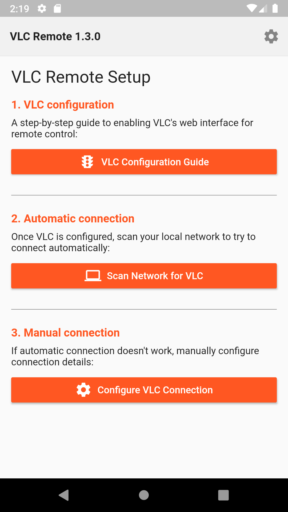
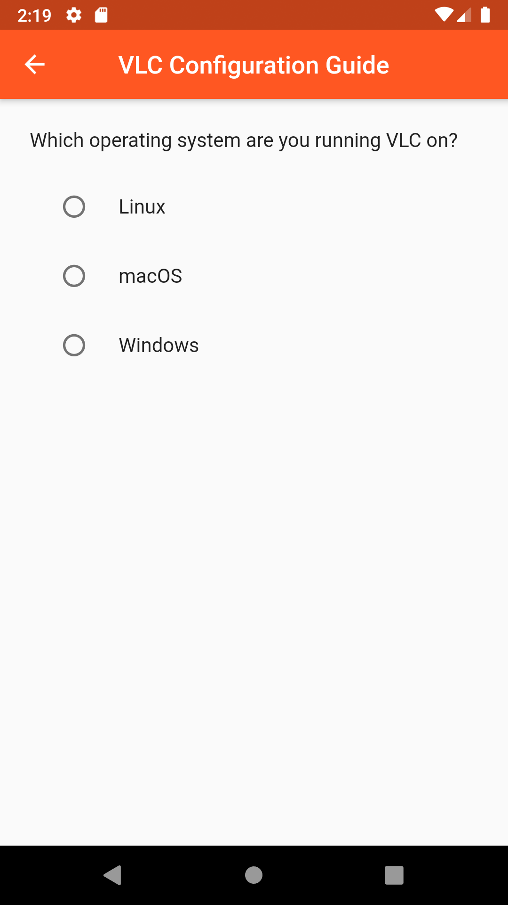
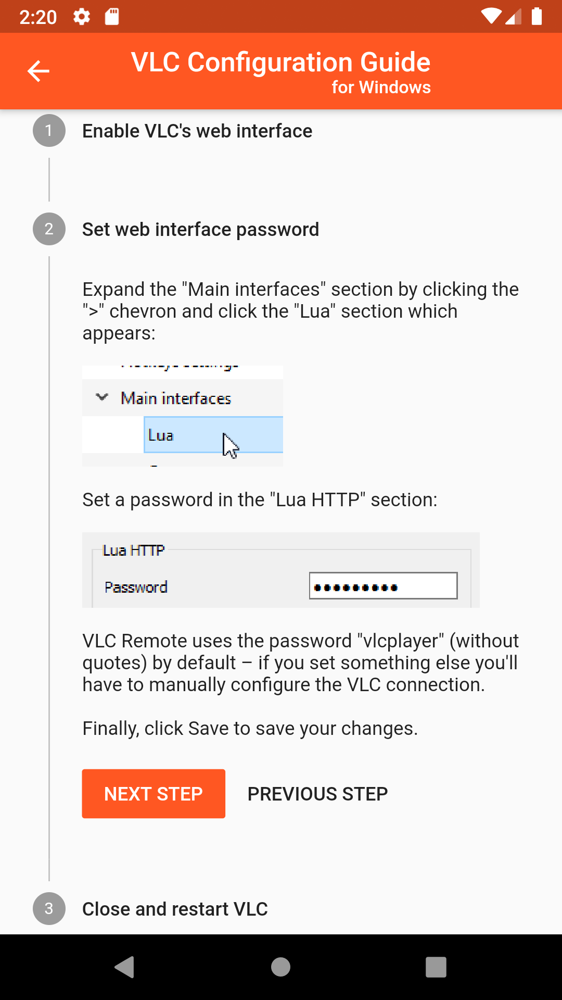
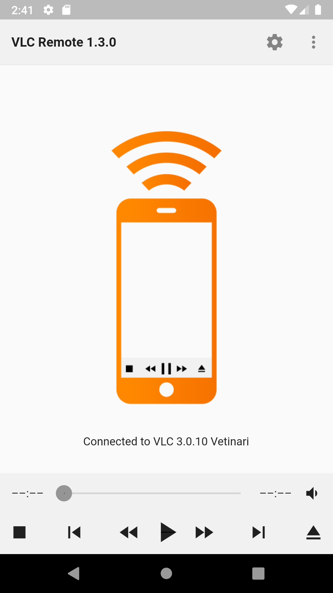
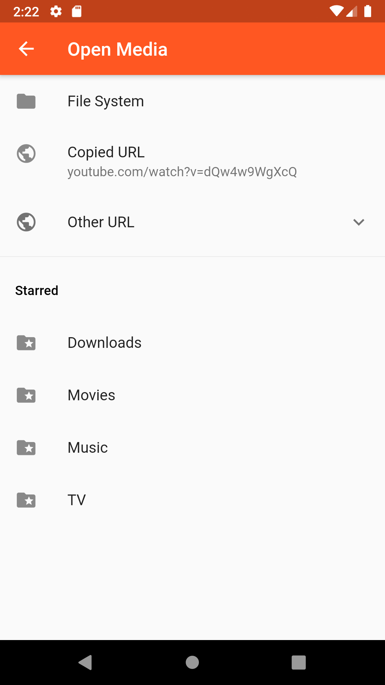
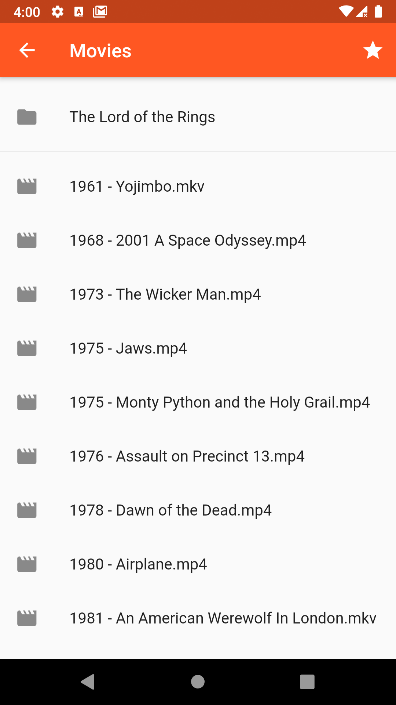
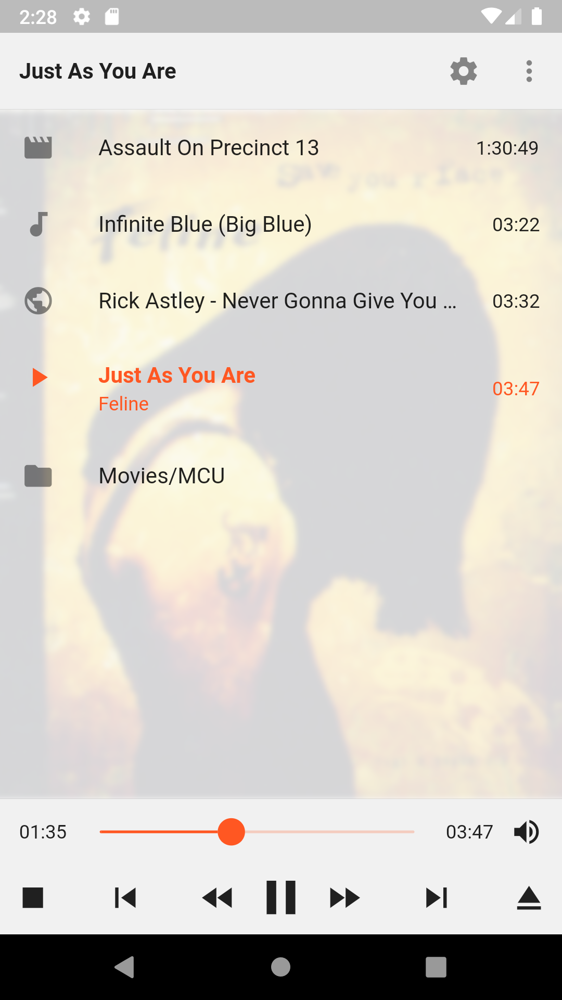
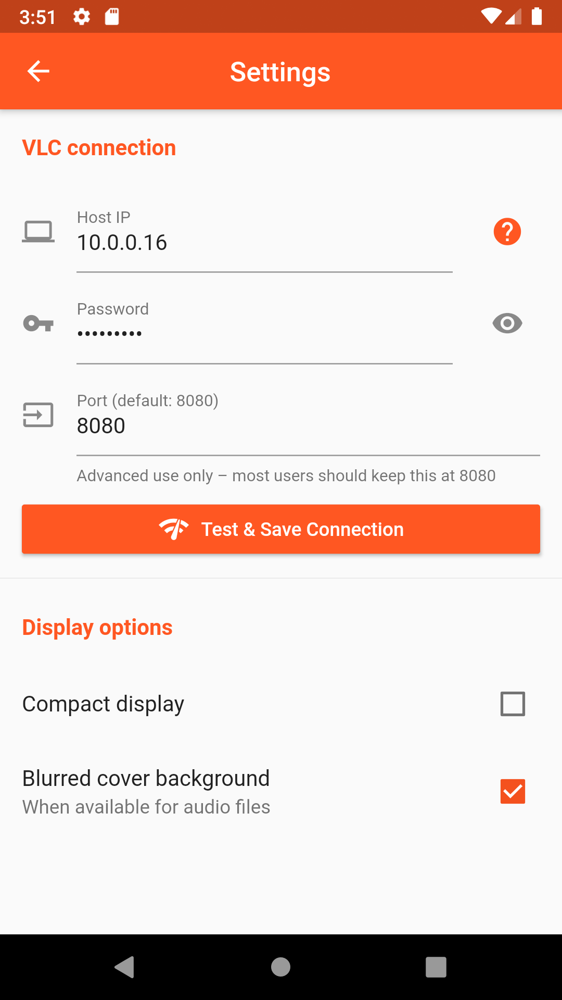
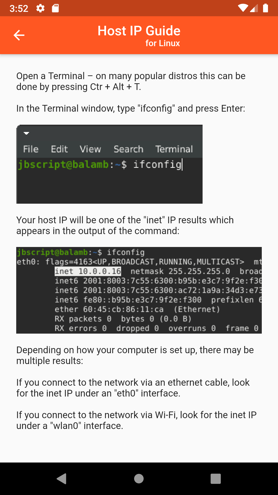

# VLC Remote

A [VLC](https://www.videolan.org/vlc/) remote control written with [Flutter](https://flutter.io/).

## Setup

### Configure VLC on your computer

1. First, you will need to start VLC's built-in server for VLC Remote to connect to.

   Open VLC's preferences (**Tools → Preferences** on Windows/Linux), find the **"Show settings"** section and click **"All"** to view advanced settings:

   

2. Scroll down to find the Interface → Main interfaces settings and check the **"Web"** option:

   

3. Switch to the Interface → Main interfaces -> Lua settings and set a password for the VLC server in the "Lua HTTP" section:

   VLC Remote uses **vlcplayer** as its default password - if you set this now, you'll have one less thing to configure later.

   

4. Finally, restart VLC and open VLC Remote on your phone.

### Connect to VLC from VLC Remote

Use the cog icon in the title bar to open the Settings screen.

For initial setup, VLC Remote will try to pre-fill the start of your LAN IP in the Host IP section.

You will need to look up your computer's IP address and configure it here:

  
Looking up your IP on Windows

  <ul>
    <li>Open a Command Prompt</li>
    <li>Type <kbd>ipconfig</kbd> and press enter to run the command</li>
    <li>Look for <code>IPv4 Address</code> in the command's output, which should have an IP address similar to the Host IP setting in the app</li>
  </ul>

  
Looking up your IP on Linux/Mac

  <ul>
    <li>Open a Terminal</li>
    <li>Type <kbd>ifconfig</kbd> and press enter to</li>
    <li>Look for <code>eth0</code> in the command's output, which should have an IP address similar to the Host IP setting in the app</li>
  </ul>

Once you've configured the Host IP address (and the Password if you didn't use `vlcplayer`) click the Test Connection button.

If VLC Remote was able to successfully connect, the connection info will be saved.

## Screenshots

### Initial setup

### Browsing for and playing media

### Settings

